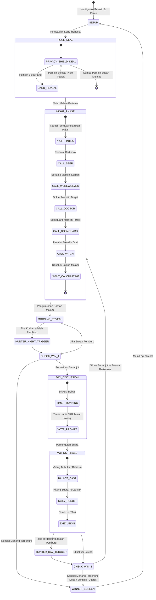

# Product Requirement Document (PRD)
# Werewolf Companion & Auto-Moderator Web Application

**Versi Dokumen:** 1.0.0  
**Tanggal:** 17 Agustus 2026  
**Status:** Disetujui (Approved)  
**Target Platform:** Web Browser (Mobile, Tablet, Desktop) — Static SPA (PWA Ready)  
**Bahasa Aplikasi:** Bahasa Indonesia  

---

## 1. Eksekutif & Ringkasan Produk

### 1.1 Visi Produk
Aplikasi **Werewolf Companion & Auto-Moderator** adalah platform web satu-layar (*single-device pass-and-play*) yang bertindak sebagai pemandu / moderator otomatis untuk permainan pesta sosial (*social deduction board game*) Werewolf di dunia nyata. Aplikasi ini menggantikan peran moderator manusia konvensional, sehingga semua pemain yang hadir di ruangan dapat ikut serta bermain secara adil tanpa ada yang harus berkorban menjadi narator.

### 1.2 Masalah yang Diselesaikan
1. **Kebutuhan Moderator Dedikasi:** Pada game Werewolf tradisional, 1 orang harus menjadi narator dan tidak bisa ikut bermain.
2. **Kecurangan & Bocoran Suara:** Moderator manusia sering kali tanpa sengaja membocorkan arah gerakan atau suara pemain yang membuka mata di malam hari.
3. **Ketergantungan Internet/Koneksi:** Banyak game digital Werewolf memerlukan setiap pemain memiliki HP dan koneksi internet stabil (WebSockets/Cloud server). Aplikasi ini bekerja 100% *offline-first* di satu perangkat bersama (laptop/tablet/ponsel yang dioper atau diletakkan di tengah meja).
4. **Kebingungan Aturan & Perhitungan:** Menghitung kombinasi efek malam (racun penyihir vs save dokter vs perlindungan bodyguard vs kill serigala) sering rawan salah hitung oleh manusia.

### 1.3 Target Pengguna (User Persona)
- **Komunitas & Grup Nongkrong:** 5 hingga 16 orang yang berkumpul langsung di kafe, rumah, atau acara komunitas.
- **Game Master / Host Kasual:** Pengguna yang ingin menjalankan game Werewolf secara cepat tanpa perlu membawa kartu fisik atau buku aturan tebal.

---

## 2. Batasan Teknis & Lingkup Sistem

### 2.1 In-Scope (Fitur Utama)
- **Operasional 1 Perangkat (Pass & Play):** Mekanisme serah terima perangkat dengan layar perantara rahasia (*privacy shields*).
- **Client-Side Only:** Tidak memerlukan backend, database eksternal, atau WebSockets. Semua state tersimpan dalam memori browser dan `localStorage`.
- **Dynamic Role Balancer:** Algoritma otomatis untuk merekomendasikan dan menyeimbangkan jumlah serigala, peran khusus, dan warga desa berdasarkan total pemain (5–16).
- **Anti-Metagaming Protection:** Langkah samaran / durasi jeda konstan pada fase malam agar pemain lain yang memejamkan mata tidak bisa menebak peran hidup/mati berdasarkan kecepatan klik layar.
- **Full Rule Resolution Engine:** Mesin kalkulator resolusi malam dan siang yang menangani prioritas aksi, efek *save*, racun, tembakan pemburu, dan kemenangan khusus (*Jester*).
- **Web Audio API Sound Engine:** Audio sintesis prosedural 100% murni (*synthesizer oscillators & noise generator*) untuk suara latar, lonceng, detak jantung, dan efek ketukan tanpa memerlukan file MP3/WAV eksternal.
- **State Recovery:** Otomatis menyimpan state ke `localStorage` di setiap perubahan aksi/fase sehingga jika halaman ter-refresh tidak akan kehilangan progres permainan.

### 2.2 Out-of-Scope (Bukan Prioritas Saat Ini)
- Fitur multi-device realtime (room code via WebRTC / WebSocket).
- Akun pengguna, login cloud, atau leaderboard global.
- Voice recognition / AI speech synthesis eksternal berbayar.

---

## 3. Matriks & Spesifikasi Detail Peran (Roles Matrix)

| Peran (ID) | Faksi | Tipe Aksi | Prioritas Malam | Efek & Aturan Khusus |
| :--- | :--- | :--- | :---: | :--- |
| **Serigala** (`WEREWOLF`) | Serigala | Aktif (Kolektif) | 3 | Memilih 1 korban tiap malam. Semua serigala melihat pilihan yang sama saat membuka mata bergiliran atau bersama. |
| **Warga Desa** (`VILLAGER`) | Desa | Pasif | - | Tidak memiliki kekuatan malam. Berpartisipasi penuh saat diskusi dan voting siang. |
| **Peramal** (`SEER`) | Desa | Aktif (Investigasi)| 2 | Memilih 1 pemain hidup untuk diintip identitasnya. Sistem menampilkan apakah target "SERIGALA" atau "BUKAN SERIGALA". |
| **Dokter** (`DOCTOR`) | Desa | Aktif (Proteksi) | 4 | Memilih 1 pemain untuk disembuhkan. Dapat melindungi dari serangan Serigala. *Aturan default:* Boleh memilih diri sendiri, namun tidak boleh memilih target yang sama 2 malam berturut-turut. |
| **Bodyguard** (`BODYGUARD`) | Desa | Aktif (Proteksi) | 4 | Melindungi 1 pemain dari kematian akibat Serigala. Tidak boleh melindungi diri sendiri, dan tidak boleh memilih target yang sama 2 malam berturut-turut. |
| **Penyihir** (`WITCH`) | Desa | Aktif (Kekuatan Ganda)| 5 | Memiliki 1× Ramuan Penyembuh (menyelamatkan korban serigala malam itu) dan 1× Ramuan Racun (membunuh 1 pemain langsung tanpa bisa di-save). Masing-masing hanya dapat digunakan 1 kali sepanjang permainan. |
| **Pemburu** (`HUNTER`) | Desa | Reaktif (Balas Dendam)| Khusus | Jika Pemburu mati (baik karena serangan serigala, racun penyihir, atau digantung di siang hari), Pemburu segera memilih 1 pemain untuk ditembak mati seketika. |
| **Orang Gila** (`JESTER`) | Netral | Pasif / Khusus | - | Memiliki agenda independen. Jika Jester berhasil membuat dirinya **dieksekusi/digantung melalui voting siang**, Jester dinyatakan sebagai Pemenang Utama (*Standalone/Special Winner*). |

---

## 4. Mesin Logika & Resolusi Aturan (Rule Engine & Edge Cases)

### 4.1 Urutan Resolusi Fase Malam (*Night Resolution Order*)
Resolusi aksi malam dihitung secara deterministik dengan urutan prioritas:
1. **Aksi Investigasi Peramal:** Informasi faksi target langsung ditampilkan secara privat kepada Peramal saat gilirannya di malam hari.
2. **Aksi Racun Penyihir:** Jika Penyihir menggunakan racun pada Pemain $X$, status Pemain $X$ ditandai mati oleh racun (*Poisoned*). Racun **tidak dapat** dinetralkan oleh Dokter, Bodyguard, maupun Ramuan Penyembuh.
3. **Aksi Serangan Serigala vs Proteksi:**
   - Serigala menargetkan Pemain $Y$.
   - Cek apakah Pemain $Y$ dilindungi oleh:
     - Dokter (disembuhkan), ATAU
     - Bodyguard (dilindungi), ATAU
     - Penyihir (menggunakan ramuan penyembuh).
   - Jika **salah satu atau lebih** proteksi aktif pada Pemain $Y$, serangan Serigala **gagal** (Pemain $Y$ tetap hidup).
   - Jika tidak ada proteksi, Pemain $Y$ ditandai mati oleh serigala (*Killed by Werewolf*).
4. **Kompilasi Kematian Malam:**
   - Semua pemain yang ditandai mati diumumkan sekaligus pada layar pengumuman pagi (*Morning Result Screen*).
   - Jika ada kematian yang melibatkan Pemburu, fase balas dendam Pemburu segera diaktifkan sebelum diskusi siang dimulai.

### 4.2 Matriks Kasus Khusus (*Edge Cases Resolution Matrix*)

| Skenario | Hasil Resolusi |
| :--- | :--- |
| Serigala menargetkan A, Dokter mengobati A | A selamat. Tidak ada korban serigala. Log pagi mencatat malam yang damai atau target selamat. |
| Serigala menargetkan A, Bodyguard melindungi A, Dokter mengobati A | A selamat (proteksi ganda tidak bentrok). |
| Serigala menargetkan A, Penyihir meracuni B | A dan B keduanya mati pada malam tersebut. |
| Serigala menargetkan A, Penyihir meracuni A, Dokter mengobati A | A tetap mati karena racun penyihir mengabaikan penyembuhan dokter. |
| Serigala menargetkan Dokter, Dokter mengobati diri sendiri | Dokter selamat (jika aturan *self-heal* diizinkan dan bukan malam kedua berturut-turut). |
| Pemburu mati di malam hari (oleh serigala/racun) | Setelah pengumuman pagi, layar Pemburu muncul: Pemburu memilih 1 target untuk dibunuh sebelum diskusi siang. |
| Pemburu mati saat voting siang | Segera setelah palu eksekusi jatuh, layar Pemburu muncul: Pemburu memilih 1 target mati sebelum malam dimulai. |
| Hasil Voting Siang Seri (Tie) | **Peaceful Day:** Tidak ada yang digantung. Permainan langsung beralih ke Fase Malam berikutnya. |
| Jester digantung pada Voting Siang | **Jester Menang!** Game Over / Pemenang Khusus dideklarasikan dengan layar perayaan Jester. |
| Jester dibunuh Serigala / Diracun di malam hari | Jester mati biasa dan **tidak menang**. |

### 4.3 Kondisi Kemenangan (*Win Conditions*)
Pemeriksaan kemenangan dilakukan pada setiap titik transisi kematian (setelah malam, setelah balas dendam pemburu, setelah voting siang):

1. **Kemenangan Warga Desa (Villagers Win):**
   - Kondisi: **Jumlah Serigala yang masih hidup = 0**.
2. **Kemenangan Serigala (Werewolves Win):**
   - Kondisi: **Jumlah Serigala hidup $\ge$ Jumlah Warga Desa hidup**.
3. **Kemenangan Khusus Jester (Jester Win):**
   - Kondisi: **Jester dieksekusi melalui pemungutan suara (voting) siang hari**.

---

## 5. Alur Permainan & Arsitektur State Machine



---

## 6. Spesifikasi Antarmuka & Interaksi Layar (UI/UX)

### 6.1 Prinsip Desain Visual
- **Tema:** *Rustic Folk Mystery* — Nuansa pedesaan klasik bernuansa kayu, perkamen, dan langit berbintang.
- **Palet Warna:**
  - **Malam (Dark Mode Dinamis):** Deep Midnight Slate (`#0f172a`), Mystic Indigo (`#1e1b4b`), Crimson Accent (`#dc2626`).
  - **Siang (Light Mode Hangat):** Warm Parchment/Cream (`#fdf8f0`), Earth Amber (`#d97706`), Forest Moss (`#15803d`).
- **Tipografi:** Serif elegan untuk judul (*Cinzel* / *Playfair Display* / *Georgia*) dipadukan dengan Sans-Serif bersih (*Inter* / *Outfit*) untuk keterbacaan instruksi cepat.
- **Ikonografi & Ilustrasi:** Ilustrasi SVG bergaya sketsa vektor inline untuk setiap peran (tanpa aset gambar eksternal berat).

### 6.2 Detil Layar Aplikasi

#### 1. SetupScreen (Pengaturan Awal)
- Slider/Input jumlah pemain: rentang 5 hingga 16 pemain.
- Input daftar nama pemain (opsional kustomisasi nama, default: "Pemain 1", "Pemain 2", dst.).
- Sakelar/Toggle peran aktif dengan badge penyeimbang (indikator rekomendasi komposisi seimbang).
- Pengaturan durasi timer:
  - Durasi Diskusi Siang: Slider 60 detik – 600 detik (Default: 180 detik).
  - Durasi Aksi Malam: Slider 10 detik – 30 detik per peran (Default: 15 detik).
- Toggle Suara / Audio Ambient.
- Tombol Utama: **"Mulai Bagikan Kartu"**.

#### 2. RoleDealScreen (Pembagian Kartu Rahasia)
- Layar Perantara (*Privacy Shield*): Menampilkan tulisan "Berikan perangkat kepada **[Nama Pemain]**" + tombol **"Buka Kartu Saya"**.
- Kartu Rahasia (*Flipped Card State*): Menampilkan kartu dengan ilustrasi peran, nama peran, deskripsi kemampuan singkat, dan afiliasi faksi (Desa/Serigala/Netral).
- Tombol **"Sembunyikan & Oper ke Pemain Berikutnya"**.
- Konfirmasi akhir setelah pemain terakhir selesai melihat peran.

#### 3. NightPhaseScreen (Fase Malam & Panggilan Peran)
- Latar belakang gelap pekat dengan animasi bintang dan bulan sabit lembut.
- Narasi layar besar dengan teks perintah: "Semua pemain pejamkan mata...".
- Alur Panggilan Bergantian:
  - **Peramal:** Memilih 1 kartu pemain -> Pop-up hasil investigasi ("Pemain X adalah: SERIGALA / WARGA").
  - **Serigala:** Memilih 1 korban dari daftar pemain hidup.
  - **Dokter:** Memilih 1 pemain untuk disembuhkan.
  - **Bodyguard:** Memilih 1 pemain untuk dilindungi.
  - **Penyihir:** Menampilkan status korban serigala malam ini -> Tombol "Gunakan Ramuan Sembuh" & "Gunakan Ramuan Racun" (atau "Lewati").
- **Proteksi Dummy Action:** Jika suatu peran sudah mati / tidak ada dalam game, sistem tetap dapat menampilkan layar jeda (*Dummy Screen*) selama beberapa detik agar pemain lain yang memejamkan mata tidak mengetahui bahwa peran tersebut telah tiada.

#### 4. MorningRevealScreen (Pengumuman Pagi)
- Transisi fajar (*sunrise gradient transition*).
- Efek lonceng pedesaan / bel fajar.
- Kartu pengumuman dramatis:
  - Jika ada korban: Menampilkan nama korban yang terbunuh malam tadi beserta status peran (jika mode *reveal role on death* aktif).
  - Jika tidak ada korban: Narasi "Malam berlangsung damai, tidak ada korban jiwa yang berjatuhan!".
- Tombol: **"Lanjut ke Diskusi Siang"**.

#### 5. DayPhaseScreen (Diskusi Siang)
- Layar terang hangat dengan daftar lengkap pemain yang masih hidup dan yang sudah gugur.
- Lingkaran Timer Countdown interaktif (animasi SVG melingkar).
- Kontrol Timer: Tombol *Pause*, *Resume*, dan *+30 Detik*.
- Tombol Tindakan Utama: **"Mulai Pemungutan Suara (Voting)"**.

#### 6. VotingScreen (Pemungutan Suara)
- Pilihan Mode Voting:
  - **Mode Voting Terbuka:** Moderator mengetuk nama pemain yang menerima suara terbanyak berdasarkan hasil musyawarah langsung di meja.
  - **Mode Pass-and-Play Secret Ballot:** Setiap pemain maju bergantian mengetuk 1 target secara rahasia.
- Tally Bar chart akumulasi suara.
- Logika resolusi gantung otomatis:
  - Suara terbanyak tunggal -> Eksekusi gantung dengan konfirmasi akhir.
  - Suara seri tertinggi -> Pengumuman hasil seri (*No execution today*).

#### 7. WinnerScreen (Layar Kemenangan & Statistik)
- Tampilan kemeriahan faksi pemenang (Desa / Serigala / Jester).
- Log riwayat lengkap permainan (*Game Timeline Recap*):
  - Kematian Malam 1, Hasil Vote Siang 1, Kematian Malam 2, dst.
- Tabel daftar seluruh pemain beserta peran rahasia aslinya.
- Tombol **"Main Lagi (Pengaturan Sama)"** dan **"Konfigurasi Ulang"**.

---

## 7. Arsitektur Teknis & Struktur Data

### 7.1 Struktur Folder Proyek (Next.js App Router)
```
werewolf-app/
├── app/
│   ├── layout.tsx             # Root layout & meta tags
│   ├── page.tsx               # Main game container orchestrator
│   └── globals.css            # Custom utility classes, animations & tokens
├── components/
│   ├── screens/
│   │   ├── SetupScreen.tsx        # Screen 1: Konfigurasi permainan
│   │   ├── RoleDealScreen.tsx     # Screen 2: Pembagian kartu rahasia
│   │   ├── NightPhaseScreen.tsx   # Screen 3: Siklus aksi malam
│   │   ├── MorningRevealScreen.tsx# Screen 4: Pengumuman hasil malam
│   │   ├── DayPhaseScreen.tsx     # Screen 5: Diskusi siang & timer
│   │   ├── VotingScreen.tsx       # Screen 6: Voting & eksekusi
│   │   ├── HunterRevengeModal.tsx # Modal: Aksi balas dendam pemburu
│   │   └── WinnerScreen.tsx       # Screen 7: Hasil akhir & timeline
│   ├── ui/
│   │   ├── Timer.tsx              # Circular animated timer component
│   │   ├── PlayerCard.tsx         # Kartu status pemain
│   │   ├── AudioController.tsx    # Floating Mute/Unmute & volume
│   │   └── Modal.tsx              # Generic accessible modal
│   └── illustrations/             # Inline SVG Vector Characters
│       ├── WerewolfIcon.tsx
│       ├── VillagerIcon.tsx
│       ├── SeerIcon.tsx
│       ├── DoctorIcon.tsx
│       ├── BodyguardIcon.tsx
│       ├── WitchIcon.tsx
│       ├── HunterIcon.tsx
│       └── JesterIcon.tsx
├── lib/
│   ├── types.ts               # Core TypeScript models & Enums
│   ├── roles.ts               # Role definitions, balances, abilities
│   ├── gameReducer.ts         # Pure State Machine reducer logic
│   ├── audioEngine.ts         # Web Audio API procedural sound engine
│   └── storage.ts             # LocalStorage sync & recovery utilities
└── __tests__/
    ├── gameReducer.test.ts    # Unit tests untuk semua kasus logika game
    └── roleResolution.test.ts # Unit tests untuk matriks interaksi malam
```

### 7.2 Model Data TypeScript (`types.ts`)

```typescript
export type RoleId = 
  | 'WEREWOLF' 
  | 'VILLAGER' 
  | 'SEER' 
  | 'DOCTOR' 
  | 'BODYGUARD' 
  | 'WITCH' 
  | 'HUNTER' 
  | 'JESTER';

export type Faction = 'VILLAGE' | 'WEREWOLF' | 'NEUTRAL';

export interface RoleDefinition {
  id: RoleId;
  name: string;
  faction: Faction;
  description: string;
  nightOrder: number; // Urutan aksi malam (0 jika pasif)
  hasNightAction: boolean;
  minRecommendedPlayers: number;
}

export interface Player {
  id: string;
  name: string;
  role: RoleId;
  isAlive: boolean;
  isProtectedByDoctor: boolean;
  isProtectedByBodyguard: boolean;
  deathReason?: 'WEREWOLF' | 'POISON' | 'LYNCH' | 'HUNTER';
  deathNightOrDay?: { phase: 'NIGHT' | 'DAY'; number: number };
}

export type GamePhase = 
  | 'SETUP' 
  | 'DEAL' 
  | 'NIGHT' 
  | 'MORNING_REVEAL' 
  | 'DAY_DISCUSSION' 
  | 'VOTING' 
  | 'HUNTER_REVENGE' 
  | 'WINNER';

export type NightStep = 
  | 'SEER' 
  | 'WEREWOLF' 
  | 'DOCTOR' 
  | 'BODYGUARD' 
  | 'WITCH';

export interface WitchPotions {
  healUsed: boolean;
  poisonUsed: boolean;
}

export interface NightActionsState {
  werewolfTargetId: string | null;
  doctorTargetId: string | null;
  bodyguardTargetId: string | null;
  seerInspectedId: string | null;
  witchHealTargetId: string | null;
  witchPoisonTargetId: string | null;
}

export interface GameSettings {
  dayDiscussionDurationSec: number;
  nightActionDurationSec: number;
  revealRoleOnDeath: boolean;
  allowDoctorSelfHealConsecutive: boolean;
  soundEnabled: boolean;
}

export interface GameLogEntry {
  id: string;
  roundNumber: number;
  phase: 'NIGHT' | 'DAY';
  title: string;
  description: string;
  timestamp: number;
}

export interface GameState {
  phase: GamePhase;
  roundNumber: number;
  players: Player[];
  settings: GameSettings;
  activeNightStepIndex: number;
  currentNightSteps: NightStep[];
  nightActions: NightActionsState;
  witchPotions: WitchPotions;
  lastDoctorTargetId: string | null;
  lastBodyguardTargetId: string | null;
  morningDeaths: string[]; // Player IDs killed in current night
  votingTally: Record<string, number>; // TargetId -> Count
  winner: 'VILLAGE' | 'WEREWOLF' | 'JESTER' | null;
  hunterTriggerSource: 'NIGHT' | 'DAY' | null;
  historyLogs: GameLogEntry[];
}
```

---

## 8. Spesifikasi Sistem Audio (Web Audio API Synthesizer)

Aplikasi tidak memuat file eksternal audio berukuran besar, melainkan menggunakan sintesis gelombang prosedural audio (*pure JavaScript Web Audio API*) untuk menjamin performa super cepat dan kemampuan *offline 100%*:

1. **Night Ambient Sound:**
   - Sintesis *white/pink noise* lembut berfilter low-pass + generator chirp jangkrik periodik (*sine wave modulated frequency* 4.5 kHz – 5.2 kHz).
2. **Day Ambient Sound:**
   - Akord arpeggio petikan santai bernuansa pedesaan (*sine/triangle waves* C-Major / G-Major dengan decay lembut).
3. **Village Bell Chime (Lonceng Desa):**
   - Kombinasi 3 oscilator (fundamental 440 Hz, harmonik 880 Hz & 1320 Hz) dengan kurva eksponensial decay menyerupai lonceng gereja/balai desa perunggu.
4. **Dramatic Heartbeat (Detak Jantung):**
   - Sub-bass sine wave (55 Hz -> 35 Hz) dengan amplop ganda (*lub-dub*) untuk momen pengumuman korban dan detik-detik akhir voting.
5. **Card Flip & Button Tap:**
   - Filtered noise burst singkat (30ms) dengan gain dinamis.
6. **Victory / Fanfare:**
   - Arpeggio nada brass kental (*sawtooth wave with gentle lowpass filter*) untuk selebrasi kemenangan.

---

## 9. Rencana Pengujian & Kriteria Keberterimaan (Acceptance Criteria)

### 9.1 Matriks Skenario Pengujian Unit (*Unit Test Cases*)
- `UT-01`: **Kemenangan Desa** — Saat semua pemain ber-role `WEREWOLF` gugur, status menang berubah menjadi `VILLAGE`.
- `UT-02`: **Kemenangan Serigala** — Saat jumlah serigala $\ge$ jumlah warga desa hidup, status menang berubah menjadi `WEREWOLF`.
- `UT-03`: **Kemenangan Jester** — Ketika pemain `JESTER` digantung pada voting siang, `winner` langsung menjadi `JESTER`.
- `UT-04`: **Penyelamatan Dokter** — Jika serigala menargetkan Pemain A dan Dokter memilih Pemain A, daftar `morningDeaths` tidak memuat Pemain A.
- `UT-05`: **Bypass Racun Penyihir** — Jika Penyihir meracuni Pemain B dan Dokter mengobati Pemain B, Pemain B tetap masuk dalam `morningDeaths`.
- `UT-06`: **Pemicu Balas Dendam Pemburu** — Ketika Pemburu terbunuh, state game wajib bertransisi ke `HUNTER_REVENGE` sebelum fase berikutnya.
- `UT-07`: **Hasil Vote Seri** — Ketika 2 pemain mendapat jumlah vote tertinggi yang sama, tidak ada pemain yang dieliminasi.
- `UT-08`: **Pemulihan LocalStorage** — Ketika state diubah lalu halaman di-refresh, state dikembalikan secara identik dari `localStorage`.

### 9.2 Kriteria Non-Fungsional (NFR)
- **Performa:** Skor Google Lighthouse $\ge 95$ pada performa, aksesibilitas, dan SEO.
- **Responsif:** Tampilan sempurna pada layar mobile (360px width) hingga monitor desktop (4K).
- **Keamanan Privasi:** Informasi peran tidak boleh bocor melalui DOM inspector sebelum pemain menekan tombol *Reveal*.

---

## 10. Konvensi & Persetujuan Dokumen

Dokumen PRD ini menjadi acuan tunggal dan baku (*Single Source of Truth*) untuk seluruh proses pengembangan kode, pengujian unit, pembuatan komponen antarmuka, dan peluncuran aplikasi **Werewolf Companion & Auto-Moderator**.